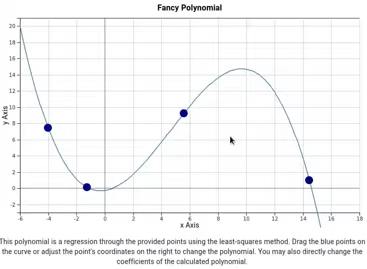

# Polynomial Curve Fitting

[](https://opensource.org/licenses/MIT)
[](https://www.npmjs.com/package/polynomial-curve-fitting)

_A React component to interactively compile polyomial curves with D3 using least squares regression_



## Installation

```bash
npm i polynomial-curve-fitting
```

## Usage

Use the react component generating a random curve:

```jsx
import React from 'react';
import CurveGenerator from 'polynomial-curve-fitting';

const App = () => <CurveGenerator></CurveGenerator>;

export default App;
```

The following sections show:

1. how to specify a curve
2. how to provide graph settings
3. how to get the curve as output

### Specify a Curve

To provide initial information about the curve, there are three options:

1. Use `PropsBaseCurve` and specify the following fields (all optional):

   ```javascript
   const curve = {
     name: 'Fancy Polynomial',
     description: 'This polynomial is a random polynomial.',
     xAxis: { label: 'x Axis', min: 0, max: 10 },
     yAxis: { label: 'y Axis', min: 0, max: 10 },
   };
   ```

2. Use `PropsCurvePoints` to specify points for the least squares regression. The order of the polynomial will be one less than the number of provided points. The fields of `PropsBaseCurve` are still optional, but the `points` field is required:

   ```javascript
   const curve = {
     points: [
       [0, 0],
       [1, 1],
     ],
   };
   ```

3. Use `PropsCurveOrder` to specify the order of the polynomial. The points on the curve are randomly generated. The fields of `PropsBaseCurve` are still optional, but the `polynomialOrder` field is required:

   ```javascript
   const curve = {
     polynomialOrder: 2,
   };
   ```

Provide the information about the curve as follows:

```jsx
const App = () => <CurveGenerator curve={curve}></CurveGenerator>;
```

### Provide Settings

In addition to the `curve` prop, there is also a `settings` prop that allows to set the style of the drawn graph (e.g, the size of the svg, font sizes, colors, and spacing). Have a look at the [default props](./src/default-props.ts) to see the default settings and what can be changed.

```jsx
const App = () => <CurveGenerator settings={settings}></CurveGenerator>;
```

### Get Curve

To get updates on the curve while changing it within the component, use a callback function as shown in the following example:

```jsx
const App = () => {
  const [curve, setCurve] = React.useState();
  return (
    <div>
      <CurveGenerator curveChange={value => setCurve(value)}></CurveGenerator>
      <pre>
        {JSON.stringify(curve, (k, c) => (v instanceof Array ? JSON.stringify(v, null) : v), 3)}
      </pre>
    </div>
  );
};
```

## Development

The following steps show how to make changes to `polynomial-curve-fitting` and use the component in an `pcf-example` react app. The commands used below assume that the two projects are sibling directories.

### Clone and Build `polynomial-curve-fitting`

Within the terminal, execute the following commands:

```bash
# clone the repository
git clone https://github.com/alexscheitlin/polynomial-curve-fitting.git

# install the dependencies
cd polynomial-curve-fitting
npm install

# continuously build the library
npm run build:watch
```

### Create new React App `pcf-example`

Open a new terminal tab and execute the following commands:

```bash
# create new react app with typescript
npx create-react-app pcf-example --template typescript

# install this library as a dependency
cd pcf-example
npm install ../polynomial-curve-fitting

# link react of the library with the one of the example react app
cd ../polynomial-curve-fitting/
npm link ../pcf-example/node_modules/react

# only do this if the example react app uses material ui
# link material ui of the library with the one of the example react app
npm link ../pcf-example/node_modules/@material-ui/core

# start the example react app
cd ../pcf-example/
npm run start
```

Add the react component to the `App.tsx` file (see Usage)
